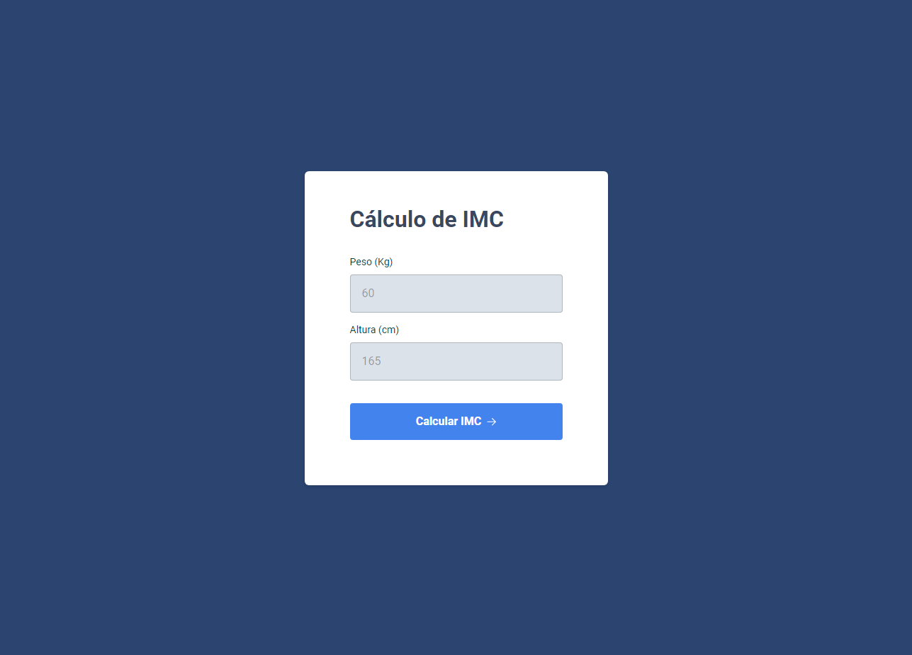

<h1 align="center"> Calculadora de IMC </h1>

Projeto desenvolvido no curso Explorer da Rocketseat.

  <a href="#-tecnologias">Tecnologias</a>&nbsp;&nbsp;&nbsp;|&nbsp;&nbsp;&nbsp;
  <a href="#-projeto">Projeto</a>&nbsp;&nbsp;&nbsp;|&nbsp;&nbsp;&nbsp;
  <a href="#-layout">Layout</a>&nbsp;&nbsp;&nbsp;|&nbsp;&nbsp;&nbsp;
  <a href="#-contato">Contatos</a>

  

## 🚀 Tecnologias

Esse projeto foi desenvolvido com as seguintes tecnologias:

- HTML
- CSS
- JavaScript
 

## 💻 Projeto

A calculadora de IMC e um desafio desenvolvido no curso explorer da Rocketseat aonde manipulamos a DOM e mexemos com os Modulos do Javascript.
 

## 🔖 Layout

Você pode visualizar o layout do projeto através [DESSE LINK](https://www.figma.com/file/pLfv1JXHSJzNPsepTnnDEa/IMC-(Copy)?node-id=6%3A4). É necessário ter conta no [Figma](https://figma.com) para acessá-lo.
 

## 📱 Contato

dilanferrari@hotmail.com  
<a>https://www.linkedin.com/in/dilanferrari/</a>